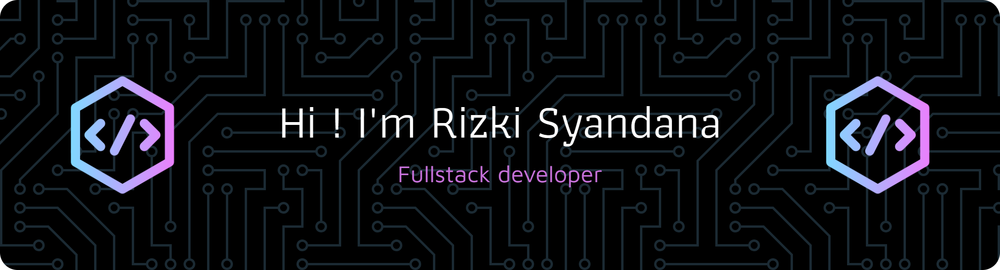

 

# Rizki Syandana

**Full-Stack Web Developer** · Indonesia 🇮🇩

 

&nbsp;

&nbsp;

 

Full-stack developer specializing in **Laravel** and the modern PHP ecosystem. I build web applications with clean architecture — purposeful, maintainable systems that solve real problems. Currently expanding into JavaScript architecture and system design patterns.

 

## Stack

 

## Stats

  
  
  

 

## Real Projects
 
| Project | About | Stack |
|---------|-------|-------|
| [**SIKAMTARA**](https://github.com/akuiki1/sikamtara) | Village digital services platform — public service workflows, financial transparency · *Best Final Project · Official learning module* |  |
| [**SIKASIR**](https://github.com/akuiki1/sikasir) | Modern point-of-sale system — barcode transactions, real-time cart, inventory management |  |
| [**LEVIATHAN**](https://github.com/akuiki1/leviathan) | Government budgeting intelligence platform — budget allocation analysis, planning support, and policy evaluation · *Anugerah ASN Provincial Innovation Competition* |  |

 

## Now

Building business-oriented web apps with Laravel · advancing JavaScript architecture and software design patterns · exploring scalable system design and modern development workflows.

 

---

  Building software that solves real problems.

