<!-- # 👋 Welcome to My Digital Realm! -->
<div align="center">

### 📌 Quick Navigation  

<a href="#-about-me">
  
</a>
<a href="#️-my-arsenal-of-technologies">
  
</a>
<a href="#-github-analytics">
  
</a>
<a href="#-achievement-unlocked">
  
</a>
<a href="#-current-mission">
  
</a>
<a href="#-contribution-graph">
  
</a>
<a href="#-featured-projects">
  
</a>
<a href="#-connect-with-me">
  
</a>
<a href="#-random-dev-quote">
  
</a>
<a href="#-currently-vibing-to">
  
</a>

</div>


<div align="center">

## 🌟 **Code Alchemist & Digital Architect** 🌟

*"Turning caffeine into code, one commit at a time"* ☕️→💻

[](https://git.io/typing-svg)

</div>

---

## 🚀 **About Me**

```javascript
const rizki = {
    name: "Rizki Syandana",
    role: "Full Stack Developer",
    location: "Indonesia 🇮🇩",
    passion: ["Clean Code", "Problem Solving", "Continuous Learning"],
    currentlyLearning: ["Advanced React Patterns", "System Design"],
    funFact: "I debug code better when listening to lo-fi music 🎵",
    motto: "Code with purpose, build with passion! 🔥"
};
```

---

## 🛠️ **My Arsenal of Technologies**

<div align="center">

### 🎨 **Frontend Magic**


### 🎯 **Styling Superpowers**


### ⚙️ **Backend Wizardry**


</div>

---

## 📊 **GitHub Analytics**

<div align="center">


</div>

<div align="center">
<!-- Option 1: DemoLab (recommended) -->
[](https://git.io/streak-stats)

<!-- Option 2: Alternative host -->
[](https://git.io/streak-stats)

<!-- Option 3: Different style -->
[](https://git.io/streak-stats)

</div>

---

## 🏆 **Achievement Unlocked**

<div align="center">

[](https://github.com/ryo-ma/github-profile-trophy)

</div>

---

## 🎯 **Current Mission**

```mermaid
graph LR
    A[💡 Idea] --> B[📝 Plan]
    B --> C[👨‍💻 Code]
    C --> D[🧪 Test]
    D --> E[🚀 Deploy]
    E --> F[📊 Monitor]
    F --> G[🔄 Iterate]
    G --> A
```



- 🌱 **Growing:** Advanced React patterns and performance optimization
- 🔭 **Building:** Next-gen web applications with modern tech stack
- 🤔 **Exploring:** Microservices architecture and cloud technologies
- 💬 **Ask me about:** Web development, Laravel, React, or anything tech!

---

## 📈 **Contribution Graph**

<div align="center">

[](https://github.com/ashutosh00710/github-readme-activity-graph)

</div>

---

## 🎨 **Featured Projects**

<div align="center">

<a href="https://github.com/akuiki1/sikamtara">
  
</a>
<a href="https://github.com/akuiki1/leviathan">
  
</a>

</div>

---

## 🌐 **Connect with Me**

<div align="center">

[](mailto:rizkisyandana7@gmail.com)
[](https://linkedin.com/in/your-profile)
[](https://your-portfolio.com)

</div>

---

## 💭 **Random Dev Quote**

<div align="center">


</div>

---

## 🎵 **Currently Vibing To**

<div align="center">

<div align="center">
  <a href="https://open.spotify.com/user/31py3qwahsl76foqwc5f55butple">
    
  </a>
  <!-- 
  <a href="https://app.daily.dev/kimmyxpow"></a> -->
</div>

</div>

---

<div align="center">

### 🚀 *"Code is like humor. When you have to explain it, it's bad."* - Cory House

**Thanks for stopping by! Let's build something amazing together! 🌟**


---

<sub>⭐️ From [Rizki Syandana](https://github.com/akuiki1) with ❤️</sub>

</div>